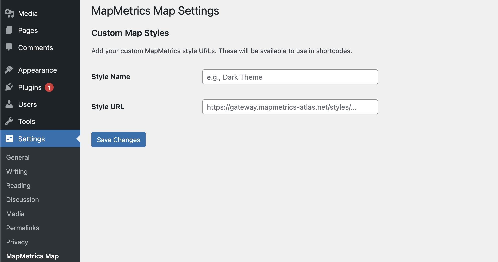
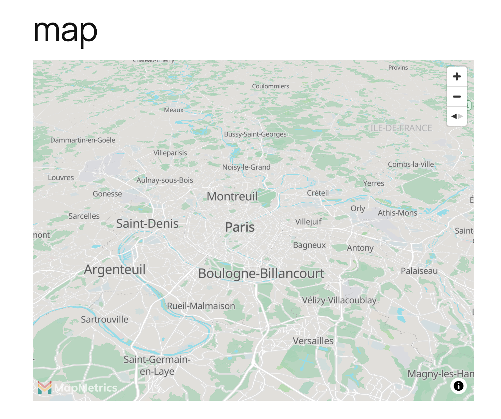
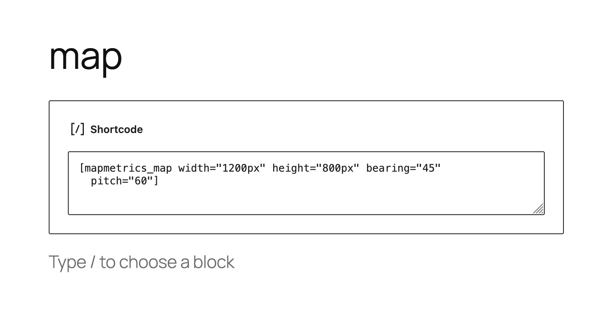

# MapMetrics Map WordPress Plugin

A comprehensive WordPress plugin to embed interactive MapMetrics maps with extensive customization options including custom styles, markers, polylines, animations, and camera controls.

## Table of Contents

- [Installation](#installation)
- [Configuration](#configuration)
- [Basic Usage](#basic-usage)
- [Map Configuration](#map-configuration)
- [Markers](#markers)
- [Polylines](#polylines)
- [Animations](#animations)
- [Custom Styles](#custom-styles)
- [JavaScript API](#javascript-api)
- [Examples](#examples)

## Installation

1. Upload `mapmetrics-map-plugin` folder to `/wp-content/plugins/`
2. Activate the plugin through the 'Plugins' menu in WordPress
3. Go to Settings → MapMetrics Map to configure custom styles
4. Use the shortcode `[mapmetrics_map]` in any post or page

## Configuration

### Creating Your MapMetrics Style & API Key

Before using the plugin, you'll need to create a custom map style and API key:

#### Step 1: Create an API Key

1. Visit the [MapAtlas Key Creation Guide](https://docs.mapatlas.xyz/overview/sdk/examples/key-creation.html)
2. Follow the documentation to generate your API key
3. Save your key securely

**Important**: Keep your API key private. Never commit it to public repositories.

#### Step 2: Create Your Map Style

1. Visit the [MapAtlas Style Creation Guide](https://docs.mapatlas.xyz/overview/sdk/examples/style-creation.html)
2. Follow the tutorial to:
   - Choose a base style (Light, Dark, Satellite, Streets)
   - Customize colors, fonts, and visual elements
   - Configure map layers and features
   - Generate your style URL with embedded token

3. Copy your complete style URL:
   ```
   https://gateway.mapmetrics-atlas.net/styles/?fileName=xxx-xxx-xxx/YourStyle.json&token=your-token
   ```

### Adding Custom Map Styles to WordPress

1. Navigate to **WordPress Admin → Settings → MapMetrics Map**
2. Add a new style:
   - **Style Name**: Friendly name for your style (e.g., "Dark Theme", "Satellite")
   - **Style URL**: Full MapMetrics style URL with token
3. Click **Save Changes**
4. Use the style name in your shortcodes

**Settings Page Example:**



The settings page allows you to add multiple custom styles. Each style needs a friendly name and the complete style URL from MapAtlas.

## Basic Usage

### Minimal Map

```
[mapmetrics_map style="Light"]
```

### Custom Location

```
[mapmetrics_map style="Light" lng="5.3698" lat="52.1561" zoom="13"]
```

### Full Configuration

```
[mapmetrics_map width="1200px" height="800px" style="Dark" lng="2.349902" lat="48.852966" zoom="15" bearing="45" pitch="60"]
```

**Example: Map Display**



The map integrates seamlessly into your WordPress content with full interactivity, navigation controls, and collapsible attribution.

**Example: Shortcode Editor**



Simply add the shortcode to any post or page in WordPress. The shortcode supports all parameters for complete customization.

## Map Configuration

### Size Parameters

| Parameter | Description | Default | Example |
|-----------|-------------|---------|---------|
| `width` | Map width | `100%` | `width="800px"` or `width="80%"` |
| `height` | Map height | `500px` | `height="600px"` |

### Location Parameters

| Parameter | Description | Default | Example |
|-----------|-------------|---------|---------|
| `lng` | Longitude (center point) | `2.349902` | `lng="5.3698"` |
| `lat` | Latitude (center point) | `48.852966` | `lat="52.1561"` |
| `zoom` | Zoom level (0-22) | `11` | `zoom="15"` |
| `bearing` | Map rotation in degrees (0-360) | `0` | `bearing="90"` |
| `pitch` | Map tilt in degrees (0-60) | `0` | `pitch="45"` |

### Style Parameter

| Parameter | Description | Default | Example |
|-----------|-------------|---------|---------|
| `style` | Style name or direct URL | `default` | `style="Dark"` or `style="https://..."` |

**Note**: You must configure at least one style in Settings → MapMetrics Map before using the plugin.

### Attribution Parameter

| Parameter | Description | Default | Example |
|-----------|-------------|---------|---------|
| `attribution` | Custom attribution text (prepended to default) | empty | `attribution="© MyCompany"` |

Result: `© MyCompany | MapMetrics © OpenStreetMap`

## Markers

### Single Default Marker

```
[mapmetrics_map style="Light" marker="true"]
```

Shows a default marker at the map center.

### Single Custom Image Marker

```
[mapmetrics_map style="Light" marker="true" marker_image="https://cdn.mapmetrics.net/images/car.png" marker_width="80" marker_height="80"]
```

| Parameter | Description | Default |
|-----------|-------------|---------|
| `marker` | Show marker at center | `false` |
| `marker_image` | Custom marker image URL | empty (uses default) |
| `marker_width` | Marker width in pixels | `60` |
| `marker_height` | Marker height in pixels | `60` |

### Multiple Markers (Simple Format)

```
[mapmetrics_map style="Light" markers="2.349,48.852,80,https://cdn.mapmetrics.net/images/car.png,Click me!|5.370,52.156,60,,Another marker"]
```

**Format**: `lng,lat,size,imageURL,message|lng,lat,size,imageURL,message`

- **lng**: Longitude (required)
- **lat**: Latitude (required)
- **size**: Marker size in pixels (optional, default: 60)
- **imageURL**: Image URL (optional, default: random image)
- **message**: Click message (optional, shown as alert on click)
- Use `|` to separate multiple markers

### Multiple Markers (GeoJSON Format)

```json
[mapmetrics_map style="Light" markers_geojson='{"type":"FeatureCollection","features":[{"type":"Feature","geometry":{"type":"Point","coordinates":[2.349,48.852]},"properties":{"iconUrl":"https://cdn.mapmetrics.net/images/car.png","iconSize":[60,60],"message":"Hello"}}]}']
```

**GeoJSON Properties**:
- `iconUrl`: Image URL (optional)
- `iconSize`: [width, height] array (optional, default: [60, 60])
- `message`: Click message (optional)

## Polylines

### Single Polyline

```
[mapmetrics_map style="Light" polyline="2.34,48.85|2.35,48.86|2.36,48.87" polyline_color="#FF0000" polyline_width="5"]
```

| Parameter | Description | Default |
|-----------|-------------|---------|
| `polyline` | Coordinates as `lng,lat\|lng,lat\|...` | empty |
| `polyline_color` | Line color (hex) | `#000000` |
| `polyline_width` | Line width in pixels | `3` |

### Multiple Polylines

```
[mapmetrics_map style="Light" polylines="2.3,48.8|2.4,48.9;#FF0000;5~5.3,52.1|5.4,52.2;#0000FF;3~-0.1,51.5|-0.2,51.6;#00FF00;4"]
```

**Format**: `lng,lat|lng,lat;color;width~lng,lat|lng,lat;color;width`

- Coordinates separated by `|`
- Color and width separated by `;`
- Multiple polylines separated by `~`
- Color and width are optional (defaults: #000000, 3)

**Example with defaults**:
```
[mapmetrics_map style="Light" polylines="2.3,48.8|2.4,48.9~5.3,52.1|5.4,52.2;#FF0000"]
```

## Animations

### Auto-Zoom

Automatically zoom from a distant view to the target location on map load.

```
[mapmetrics_map style="Light" autozoom="true" autozoom_start="2" autozoom_delay="1000" autozoom_duration="3000"]
```

| Parameter | Description | Default |
|-----------|-------------|---------|
| `autozoom` | Enable auto-zoom | `false` |
| `autozoom_start` | Starting zoom level | `2` |
| `autozoom_delay` | Delay before animation (ms) | `1000` |
| `autozoom_duration` | Animation duration (ms) | `3000` |

### Auto-Loop

Automatically cycle through multiple locations infinitely.

```
[mapmetrics_map style="Light" autoloop="true" autoloop_locations="2.349,48.852,15|5.370,52.156,13|-0.127,51.507,12" autoloop_delay="3000" autoloop_duration="2000"]
```

| Parameter | Description | Default |
|-----------|-------------|---------|
| `autoloop` | Enable auto-loop | `false` |
| `autoloop_locations` | Locations as `lng,lat,zoom\|lng,lat,zoom\|...` | empty |
| `autoloop_delay` | Delay between locations (ms) | `3000` |
| `autoloop_duration` | Flight duration (ms) | `2000` |

**Note**: If both `autozoom` and `autoloop` are enabled, auto-zoom runs first, then auto-loop starts.

### Combined Animation Example

```
[mapmetrics_map style="Light" autozoom="true" autozoom_start="1" autoloop="true" autoloop_locations="2.349,48.852,15|5.370,52.156,13"]
```

This will:
1. Start at zoom level 1 (world view)
2. Zoom to the center location
3. Begin looping through the specified locations

## Custom Styles

### Using Named Styles

1. Add style in WordPress Admin (Settings → MapMetrics Map)
2. Use style name in shortcode:

```
[mapmetrics_map style="Dark Theme"]
```

### Using Direct URLs

```
[mapmetrics_map style="https://gateway.mapmetrics-atlas.net/styles/?fileName=xxx&token=yyy"]
```

### Style Management Tips

- Use descriptive names: "Light", "Dark", "Satellite", "Streets"
- Keep tokens secure and don't share publicly
- Test styles before deploying to production
- Consider creating multiple styles for different use cases

## JavaScript API

### Accessing Map Instance

Each map instance is exposed globally:

```javascript
// Get map instance by map ID
var map = window.mapmetrics_mapmetrics_xxxxx;
```

The map ID can be found in the browser console or by inspecting the map container div.

### FlyTo Function

Programmatically navigate the map to any location:

```javascript
// Basic usage
window.mapmetrics_flyTo_mapmetrics_xxxxx(lng, lat, zoom, bearing, pitch, options);
```

**Parameters**:
- `lng` (required): Longitude
- `lat` (required): Latitude
- `zoom` (optional): Zoom level (defaults to current)
- `bearing` (optional): Map rotation in degrees (defaults to current)
- `pitch` (optional): Map tilt in degrees (defaults to current)
- `options` (optional): Additional MapMetrics flyTo options

**Examples**:

```javascript
// Fly to Paris with zoom 15
mapmetrics_flyTo_mapmetrics_abc123(2.349, 48.852, 15);

// Fly to Amsterdam with rotation and tilt
mapmetrics_flyTo_mapmetrics_abc123(4.895, 52.370, 14, 45, 60);

// Fly with custom speed and curve
mapmetrics_flyTo_mapmetrics_abc123(2.349, 48.852, 15, 0, 0, {
    speed: 0.5,
    curve: 1.5,
    duration: 5000
});
```

### Custom Options

```javascript
{
    speed: 1.2,          // Animation speed multiplier
    curve: 1,            // Zoom curve (higher = more zoom out)
    duration: 2000,      // Duration in milliseconds
    essential: true      // Animation cannot be interrupted
}
```

## Examples

### Example 1: Simple City Map

```
[mapmetrics_map style="Light" lng="2.349902" lat="48.852966" zoom="12" height="600px"]
```

### Example 2: Route with Polyline

```
[mapmetrics_map style="Streets" polyline="2.34,48.85|2.35,48.86|2.36,48.87|2.37,48.88" polyline_color="#FF0000" polyline_width="4" zoom="13"]
```

### Example 3: Multiple Points of Interest

```
[mapmetrics_map style="Light" markers="2.349,48.852,80,https://cdn.mapmetrics.net/images/car.png,Eiffel Tower|2.336,48.861,80,https://cdn.mapmetrics.net/images/car.png,Arc de Triomphe" zoom="12"]
```

### Example 4: Animated Tour

```
[mapmetrics_map style="Satellite" autozoom="true" autozoom_start="2" autoloop="true" autoloop_locations="2.349,48.852,15|5.370,52.156,13|-0.127,51.507,12|13.405,52.520,13" autoloop_delay="4000" pitch="45"]
```

### Example 5: Multiple Routes with Different Colors

```
[mapmetrics_map style="Dark" polylines="2.3,48.8|2.4,48.9|2.5,49.0;#FF0000;5~5.3,52.1|5.4,52.2|5.5,52.3;#0000FF;4~-0.1,51.5|-0.2,51.6|-0.3,51.7;#00FF00;3" zoom="6"]
```

### Example 6: 3D Tilted View

```
[mapmetrics_map style="Satellite" bearing="180" pitch="60" zoom="16" height="800px"]
```

### Example 7: Custom Attribution

```
[mapmetrics_map style="Light" attribution="© MyCompany Data 2025"]
```

### Example 8: Interactive Button with FlyTo

Add this HTML to your page:

```html
<button onclick="flyToParis()">Fly to Paris</button>
<button onclick="flyToAmsterdam()">Fly to Amsterdam</button>

[mapmetrics_map style="Light" id="mymap"]

<script>
function flyToParis() {
    mapmetrics_flyTo_mapmetrics_xxxxx(2.349, 48.852, 15, 0, 45);
}

function flyToAmsterdam() {
    mapmetrics_flyTo_mapmetrics_xxxxx(4.895, 52.370, 14, 90, 60);
}
</script>
```

## Requirements

- WordPress 5.0+
- PHP 7.0+
- Modern browser with JavaScript enabled
- MapMetrics style URL with valid token

## Troubleshooting

### Map Not Showing

1. Check browser console for errors
2. Verify style URL and token are valid
3. Ensure MapMetrics GL library is loading
4. Check that container has minimum height (500px)

### Style Not Found Error

1. Go to Settings → MapMetrics Map
2. Verify style name matches exactly (case-sensitive)
3. Add style if missing

### Markers Not Appearing

1. Check coordinate format (lng, lat - not lat, lng)
2. Verify image URLs are accessible
3. Check browser console for loading errors

### Polylines Not Showing

1. Verify minimum 2 coordinate pairs
2. Check coordinate format
3. Ensure polylines are added after map loads

## Screenshots

The plugin includes visual examples to help you get started:

1. **map.png** - Interactive map display with navigation controls and attribution
2. **short_code_example.png** - Shortcode implementation in WordPress block editor
3. **map_style_setting.png** - MapMetrics Map settings page for adding custom styles

Screenshots are located in the `/screenshots/` directory of the plugin.

## Support

For issues, questions, or feature requests, please visit:
- Plugin URI: https://mapmetrics.org
- GitHub: [Your repository]

## License

GPL v2 or later

## Changelog

### Version 2.0.0
- Added custom style management
- Added bearing and pitch controls
- Added width parameter
- Added multiple polylines support
- Added custom attribution
- Added collapsible attribution control
- Improved marker system with multiple formats
- Enhanced auto-zoom and auto-loop animations
- Removed hardcoded style URLs
- Added comprehensive error handling

### Version 1.0.0
- Initial release
- Basic map embedding
- Single marker support
- Simple polyline support
- Auto-zoom feature
- Auto-loop feature
